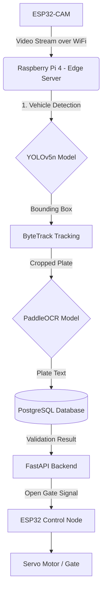

# Edge AI Vehicle Access System

This project implements an **Edge AI-based smart vehicle access system** deployed on a Raspberry Pi 4. It integrates real-time object detection, License Plate Recognition (LPR), and IoT control for a complete automated parking gate solution.

## System Architecture

## Key Features

* **Real-time Vehicle Detection**: Optimized YOLOv5 nano model running smoothly on edge hardware.
* **License Plate Recognition (LPR)**: Uses PaddleOCR/EasyOCR for high-accuracy text extraction from fast-moving vehicles.
* **Edge Deployment Optimization**: Models are converted to **ONNX / TFLite** to maximize inference speed on the Raspberry Pi CPU.
* **IoT Hardware Integration**: ESP32-CAM for wireless video streaming, and a separate ESP32 for controlling the physical gate via servo motors and RFID verification.

## Tech Stack & Hardware

| Category | Technologies / Devices |
| :--- | :--- |
| **AI / Computer Vision** | Python, OpenCV, YOLOv5, PaddleOCR, ByteTrack |
| **Backend & Database** | FastAPI, PostgreSQL |
| **Embedded / IoT** | C/C++ (Arduino IDE), ESP32-CAM, ESP32, RFID-RC522 |
| **Edge Hardware** | Raspberry Pi 4 Model B |

## Repository Structure
- `/ESP32_CAM_Firmware`: C++ code for streaming MJPEG video over WiFi.
- `/ESP32_Control_Node`: C++ code for receiving server commands and controlling the servo gate.
- `/tracking+reg_plate`: Core Python AI pipeline (Detection -> Tracking -> OCR).
- `/pipeline_test`: Scripts for evaluating model accuracy and FPS performance.

## Setup Instructions

### AI Edge Pipeline
1. Ensure Python 3.8+ is installed on the Raspberry Pi.
2. Install dependencies: `pip install -r requirements.txt` (or manually install OpenCV, torch, ultralytics, paddleocr).
3. Run the main monitoring script pointing to the ESP32-CAM IP address.

### ESP32 Nodes
1. Open the `.ino` files in Arduino IDE.
2. Install the `ESP32` board manager and required libraries (WiFi, Servo).
3. Update the SSID and Password constants, then flash to the boards.

---
*Developed as a comprehensive showcase of integrating Deep Learning at the Edge with Embedded IoT Systems.*
